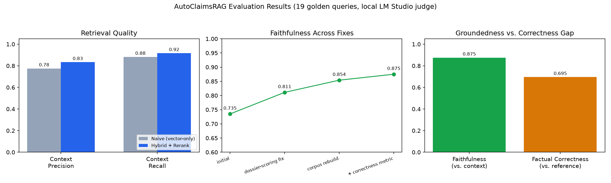

# AutoClaimsRAG

A local-first, agentic RAG system for auto insurance claims handling — built to show what happens when domain expertise and modern retrieval/agentic AI techniques compound instead of substitute for each other.

## Why this exists

Claims handlers spend a meaningful share of every day hunting through scattered PDFs, spreadsheets, and adjuster guides for the one fact that resolves a claim — a labor rate cap, an exclusion clause, a rider's eligibility window. AutoClaimsRAG was built by an insurance claims/appraisal professional with 17 years in the industry, so the evaluation and design decisions are shaped by what real adjusting judgment calls look like: exclusion stacking, regional rate caps, SIU fraud patterns, endorsement math, subrogation eligibility.

Everything in this repo runs on synthetic, generated seed data — no proprietary or confidential content of any kind.

## What it does

- Natural-language search over auto insurance guidelines, endorsements, state statutes, and adjuster reports (PDF/DOCX/XLSX/TXT)
- Per-claim document scoping — upload a claim's own dossier (police report, telematics, shop estimates) and query it alongside global policy documents in the same conversation
- An agentic router that plans multi-step retrieval, self-corrects when the first pass comes back empty, and **refuses to answer rather than let the model fabricate one** when nothing relevant was found
- Runs entirely locally: embedding, reranking, vector search, and generation (via LM Studio) all execute on-device — no document content or query ever leaves the machine

## Architecture

```
Documents (PDF/DOCX/XLSX/TXT)
        │
        ▼
DocumentParser ──▶ TextChunker (parent/child: 1200/200 + 250/50)
        │
        ▼
EmbeddingEngine (all-MiniLM-L6-v2, local)
        │
        ▼
SQLiteVectorStore
  ├─ dense vector search (child chunks, in-memory normalized cache)
  ├─ FTS5 keyword search (parent chunks)
  └─ Reciprocal Rank Fusion ──▶ RerankingEngine (cross-encoder, local)
        │
        ▼
AgenticRAGRouter
  plan (decompose query) → retrieve (per sub-query) → self-correct (if empty) → synthesize
        │
        ▼
FastAPI ──▶ frontend (claims queue, per-claim folders, chat, pipeline logs)
```

**Hybrid retrieval**: dense embeddings are good at paraphrase but weak on exact structured lookups — a query like "what's the comprehensive deductible" can under-rank a deductibles *spreadsheet* in favor of a narratively-similar case study PDF. SQLite FTS5 keyword search catches that case; the two signals are fused with Reciprocal Rank Fusion (no score calibration needed) and reordered by a local cross-encoder reranker.

**Agentic planning**: each query is decomposed into targeted sub-queries scoped to global policy, the active claim's dossier, or both. If retrieval comes back empty, a self-correction step retries with a rewritten query; if it's still empty, synthesis is skipped entirely and the system says so, rather than letting the LLM answer from its own knowledge and cite sources that don't exist.

**Performance**: vector search runs against an in-memory, pre-normalized embedding matrix cache instead of re-reading every embedding BLOB and recomputing corpus norms on every query.

### Scaling considerations

This architecture is built for one adjuster's local corpus — hundreds of documents, single machine — not a multi-tenant system with millions of documents. Being upfront about where it would actually break:

- **Vector search is brute-force, not ANN.** `search_similarity` matrix-multiplies the query against every cached embedding in scope (`matrix @ query`) — no HNSW/IVF index. Fine into the tens of thousands of chunks; the first real bottleneck at real scale.
- **The embedding cache rebuilds in full on every write.** Any add/delete invalidates the whole in-memory matrix, and the next query rebuilds it from a full table scan — O(n) per write, not incremental. This is the actual ingestion-throughput ceiling, not the vector math.
- **Everything lives in one process's RAM**, backed by a single SQLite file with no built-in horizontal scaling or concurrent-writer support (already out of scope for the MVP, see above).
- **What wouldn't need to change**: FTS5's inverted index scales sub-linearly with corpus size, and reranking cost is bounded by the candidate pool (`top_k`), not total corpus size.
- **What I'd swap in at real scale**: an ANN index (FAISS/HNSW or a managed vector DB) with incremental upsert instead of full-cache rebuild, and a database backend with concurrent-writer support (Postgres + pgvector) instead of single-file SQLite.

## Evaluation — because "it looks right" isn't good enough

19 domain-grounded queries (not generic FAQ) — exclusion stacking, labor rate caps, SIU fraud red flags, OEM/LKQ parts eligibility, endorsement math, subrogation, plus a deliberate hallucination probe — each with a reference answer verified against the actual source documents. Three things are measured, all with a fully local LM Studio judge (zero calls to any hosted API):

| Metric | What it checks | Naive | Hybrid + Rerank |
|---|---|---|---|
| Context Precision | Retrieved chunks are actually relevant | 0.775 | 0.833 |
| Context Recall | Nothing relevant was missed | 0.882 | 0.916 |
| Faithfulness | Answer is grounded in retrieved context | — | 0.875 |
| Factual Correctness | Answer covers what the verified reference requires | — | 0.695 |



**What stood out**: hybrid clearly wins on claim-scoped queries where naive vector search misses a source entirely (e.g. a shop-estimate document, 0.0→1.0 recall), and is reported honestly where it's *worse* (two queries where naive actually beat it — no cherry-picking). The most interesting result wasn't a hybrid-vs-naive story at all: one query needs two documents surfaced together (an endorsement cap *and* a claim's own receipt total), which single-shot retrieval never manages in either mode — that's the exact reason the agentic planner's guaranteed dossier-inclusion exists, and scored against the real pipeline it hits 1.0 Factual Correctness despite 0.0/0.0 on the isolated retrieval endpoint. The 18-point Faithfulness/Correctness gap is the metric doing its job: the same answers, judged two different ways, showing where "grounded" and "complete" diverge.

### Bugs this eval harness actually found and fixed

1. **Zero-context hallucination**: a planner misclassification could skip retrieval entirely and let the LLM synthesize with no context, fabricating citations. Fixed with a hard stop against zero-context synthesis.
2. **Simulated demo mode's hardcoded facts didn't match the real source documents** (wrong coverage caps, wrong eligibility thresholds, a fabricated rejection). Corrected against the real corpus.
3. **Faithfulness scoring gap**: claim-scoped answers grounded in a prompt-injected dossier weren't checked against it, so correct answers scored as unfaithful. Fixed.
4. **Multi-hop retrieval gap**: a claim's own documents were competing semantically for a slot against global policy docs and losing. Fixed by always including them directly — which then exposed a *second* bug (the LLM only reasoned about one of two line items despite having both). Both fixed and verified.
5. **The eval harness's own default metric config penalized correct answers**: Ragas's default `mode="f1"` docked well-cited, correct answers for true elaboration not in the terse reference text. Switched to `mode="recall"`.

## Try it locally

```powershell
# 1. Create and activate a virtual environment, then install dependencies
python -m venv .venv
.venv\Scripts\pip install -r requirements.txt

# 2. Generate synthetic seed guidelines and ingest them
.venv\Scripts\python generate_auto_pdfs.py
.venv\Scripts\python ingest_all.py

# 3. Start the backend (serves the frontend too)
.venv\Scripts\python -m uvicorn backend.app:app --reload --port 8000
# → http://localhost:8000

# 4. (Optional) Point LM Studio at port 1234 with any OpenAI-compatible chat model
#    loaded, then run the eval harness:
.venv\Scripts\python eval/run_eval.py
```

Without an LM Studio server running, the app falls back to a rule-based simulation mode so the UI and retrieval pipeline are still fully explorable.

## Known limitations

- **Faithfulness measures groundedness, not correctness** — an answer can be fully faithful to partial context and still be wrong. Factual Correctness closes this by scoring against a verified reference instead.
- Context Precision/Recall reflect single-shot retrieval via a debug endpoint, not the full pipeline's guaranteed claim-document inclusion; Factual Correctness *is* scored against the real `/api/chat` pipeline.
- Both LLM-judged metrics are bounded by a local 14B judge's own reasoning quality (a deliberate local-only tradeoff) and show real run-to-run variance — treat single-run scores as noisy, trust trends across reruns.
- Demo claim fixtures are currently duplicated between backend and frontend rather than served from a single source of truth.

## Tech stack

FastAPI · SQLite (custom hybrid vector + FTS5 store) · sentence-transformers (`all-MiniLM-L6-v2`) · cross-encoder reranking (`ms-marco-MiniLM-L-6-v2`) · LM Studio (local OpenAI-compatible inference) · Ragas (local evaluation) · vanilla JS frontend

## About

Built independently by [Jared Fisher](https://www.linkedin.com/in/jaredf-17680b7a) — 17 years in auto insurance claims and appraisal — as a demonstration of applying domain expertise directly to RAG and agentic AI system design, evaluation, and debugging.
