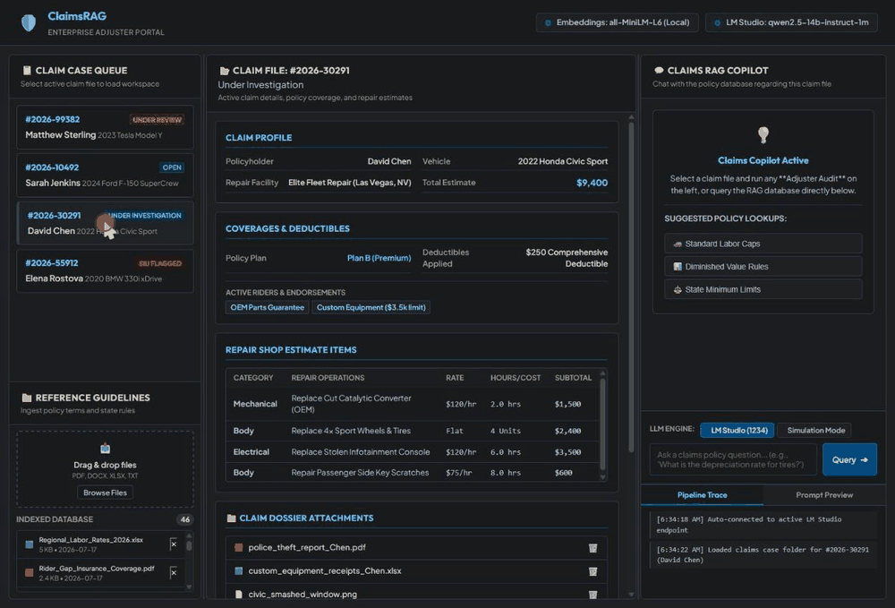

# AutoClaimsRAG

[](https://github.com/jf1shh/auto-claims-rag/actions/workflows/tests.yml)
[](LICENSE)
[](https://github.com/jf1shh/auto-claims-rag/releases/tag/v1.0.0)

A local-first, agentic RAG system for auto insurance claims handling — built to show what happens when domain expertise and modern retrieval/agentic AI techniques compound instead of substitute for each other.



*Live demo: selecting a theft claim, then running an "OEM Parts Rider" audit. The agentic router plans sub-queries, retrieves from both global policy documents and the claim's own dossier (police report, parts receipts), and a fully local 14B model synthesizes a grounded, per-line-item answer with clickable source citations.*

**Jump to:** [Why this exists](#why-this-exists) · [What it does](#what-it-does) · [FAQ (plain English)](#faq-plain-english) · [Architecture](#architecture) · [Evaluation](#evaluation--because-it-looks-right-isnt-good-enough) · [Try it locally](#try-it-locally) · [ICM workflow](#icm-workflow) · [Security posture](#security-posture) · [Known limitations](#known-limitations) · [Tech stack](#tech-stack)

## Why this exists

Claims handlers spend a meaningful share of every day hunting through scattered PDFs, spreadsheets, and adjuster guides for the one fact that resolves a claim — a labor rate cap, an exclusion clause, a rider's eligibility window. AutoClaimsRAG was built by an insurance claims/appraisal professional with 17 years in the industry, so the evaluation and design decisions are shaped by what real adjusting judgment calls look like: exclusion stacking, regional rate caps, SIU fraud patterns, endorsement math, subrogation eligibility.

Everything in this repo runs on synthetic, generated seed data — no proprietary or confidential content of any kind.

## What it does

- Natural-language search over auto insurance guidelines, endorsements, state statutes, and adjuster reports (PDF/DOCX/XLSX/TXT)
- Per-claim document scoping — upload a claim's own dossier (police report, telematics, shop estimates) and query it alongside global policy documents in the same conversation
- An agentic router that plans multi-step retrieval, self-corrects when the first pass comes back empty, and **refuses to answer rather than let the model fabricate one** when nothing relevant was found
- Runs entirely locally: embedding, reranking, vector search, and generation (via LM Studio) all execute on-device — no document content or query ever leaves the machine

## FAQ (plain English)

**What's "RAG"?** Instead of asking an AI chatbot to answer from what it memorized during training (which it can get subtly wrong or make up entirely), the system first searches your own documents for the relevant passages, then hands *those exact passages* to the AI and says "answer using only this." The answer comes with clickable citations back to the source file, so a claims handler can verify it in seconds instead of trusting it blindly.

**What does "agentic" mean here?** It doesn't just do one search and hope for the best. For "does this claim exceed the coverage cap," it plans what to look up (the endorsement terms *and* the claim's own receipt), runs both searches, checks whether it found anything useful, retries with a reworded search if not, and only then writes an answer. That plan → check → retry loop is what "agentic" means, versus a single input/output round trip.

**Does this send my data to OpenAI or the cloud?** No. The AI model, the document search, and the "read the document and score its own answer" evaluation step all run on the same machine, using free open-source models. Nothing is uploaded anywhere. That's a deliberate design constraint, not a limitation — insurance claim files are sensitive, so a real deployment can't depend on shipping them to a third party.

**What happens if it doesn't know the answer?** It says so, instead of guessing. Most chatbots will confidently invent a plausible-sounding answer (and a plausible-sounding, nonexistent source) rather than admit they found nothing. This system checks first — if the search comes back empty, it refuses to answer rather than fabricate one. That refusal path is tested directly in the evaluation results below (see the "hallucination probe" query).

**Is this connected to any real insurance company's systems or data?** No. Every document, claim, and policy number in this repo is synthetic — generated for this project, not pulled from any real claim file or company database. It was built independently, on personal time, using publicly available tools and made-up data, specifically to be shareable as a portfolio piece without touching anything confidential.

**Could an insurance company actually use something like this?** As a proof of concept, yes — the retrieval and reasoning approach is sound and measured, not hand-waved. As-is, no: it's a single-machine tool with a small demo set of documents and no multi-tenant data plane (one tenant, no concurrent-editor support). It's no longer single-*user* though: every API route now requires authentication (OIDC/SSO or service-account keys), and role-based permissions with claim-level ACLs (adjuster / supervisor / SIU / admin) are enforced. See [Scaling considerations](#scaling-considerations) and [Known limitations](#known-limitations) for exactly what would still need to change to go from "working demo" to "production system."

**Why build this instead of just pasting policy PDFs into ChatGPT?** Privacy is one reason — real claim files shouldn't go through a cloud chatbot. The bigger one: pasting one document at a time doesn't scale past a handful of files, can't scope a search to "just this claim's paperwork," doesn't cite which exact passage an answer came from, and is never *measured* for how often it's actually right (see [Evaluation](#evaluation--because-it-looks-right-isnt-good-enough)) — it just *looks* convincing.

## Architecture

```
Documents (PDF/DOCX/XLSX/TXT)
        │
        ▼
DocumentParser ──▶ TextChunker (parent/child: 1200/200 + 250/50)
        │
        ▼
EmbeddingEngine (all-MiniLM-L6-v2, local)
        │
        ▼
SQLiteVectorStore
  ├─ dense vector search (child chunks, in-memory normalized cache)
  ├─ FTS5 keyword search (parent chunks)
  └─ Reciprocal Rank Fusion ──▶ RerankingEngine (cross-encoder, local)
        │
        ▼
AgenticRAGRouter
  plan (decompose query) → retrieve (per sub-query) → self-correct (if empty) → synthesize
        │
        ▼
FastAPI ──▶ frontend (claims queue, per-claim folders, chat, pipeline logs)
```

**Hybrid retrieval**: dense embeddings are good at paraphrase but weak on exact structured lookups — a query like "what's the comprehensive deductible" can under-rank a deductibles *spreadsheet* in favor of a narratively-similar case study PDF. SQLite FTS5 keyword search catches that case; the two signals are fused with Reciprocal Rank Fusion (no score calibration needed) and reordered by a local cross-encoder reranker.

**Agentic planning**: each query is decomposed into targeted sub-queries scoped to global policy, the active claim's dossier, or both. If retrieval comes back empty, a self-correction step retries with a rewritten query; if it's still empty, synthesis is skipped entirely and the system says so, rather than letting the LLM answer from its own knowledge and cite sources that don't exist.

**Performance**: vector search runs against an in-memory, pre-normalized embedding matrix cache instead of re-reading every embedding BLOB and recomputing corpus norms on every query.

### Scaling considerations

This architecture is built for one adjuster's local corpus — hundreds of documents, single machine — not a multi-tenant system with millions of documents. Being upfront about where it would actually break:

- **Vector search is brute-force, not ANN.** `search_similarity` matrix-multiplies the query against every cached embedding in scope (`matrix @ query`) — no HNSW/IVF index. Fine into the tens of thousands of chunks; the first real bottleneck at real scale.
- **The embedding cache rebuilds in full on every write.** Any add/delete invalidates the whole in-memory matrix, and the next query rebuilds it from a full table scan — O(n) per write, not incremental. This is the actual ingestion-throughput ceiling, not the vector math.
- **Everything lives in one process's RAM**, backed by a single SQLite file with no built-in horizontal scaling or concurrent-writer support (already out of scope for the MVP, see above).
- **What wouldn't need to change**: FTS5's inverted index scales sub-linearly with corpus size, and reranking cost is bounded by the candidate pool (`top_k`), not total corpus size.
- **What I'd swap in at real scale**: an ANN index (FAISS/HNSW or a managed vector DB) with incremental upsert instead of full-cache rebuild. The other two swaps are already built behind seams and live in the repo — a `PostgresVectorStore` (Postgres + pgvector, tenant RLS, HNSW index) behind the `VectorStore` interface, and an `S3DocumentBlobStore` behind the `DocumentBlobStore` interface with presigned serving — selectable via config without touching the retrieval/agent pipeline. See `docs/enterprise-migration.md` for the phased roadmap.

## Evaluation — because "it looks right" isn't good enough

19 domain-grounded queries (not generic FAQ) — exclusion stacking, labor rate caps, SIU fraud red flags, OEM/LKQ parts eligibility, endorsement math, subrogation, plus a deliberate hallucination probe — each with a reference answer verified against the actual source documents. Three things are measured, all with a fully local LM Studio judge (zero calls to any hosted API):

| Metric | What it checks | Naive | Hybrid + Rerank |
|---|---|---|---|
| Context Precision | Retrieved chunks are actually relevant | 0.797 | 0.876 |
| Context Recall | Nothing relevant was missed | 0.912 | 0.947 |
| Faithfulness | Answer is grounded in retrieved context | — | 0.823 |
| Factual Correctness | Answer covers what the verified reference requires | — | 0.663 |


**What stood out**: hybrid clearly wins on claim-scoped queries where naive vector search misses a source entirely (e.g. a shop-estimate document, 0.0→1.0 recall), and is reported honestly where it's *worse* (two queries where naive actually beat it — no cherry-picking). The most interesting result wasn't a hybrid-vs-naive story at all: one query needs two documents surfaced together (an endorsement cap *and* a claim's own receipt total), which single-shot retrieval never manages in either mode — that's the exact reason the agentic planner's guaranteed dossier-inclusion exists, and scored against the real pipeline it hits 1.0 Factual Correctness despite 0.0/0.0 on the isolated retrieval endpoint. The ~16-point Faithfulness/Correctness gap is the metric doing its job: the same answers, judged two different ways, showing where "grounded" and "complete" diverge.

### Bugs this eval harness actually found and fixed

1. **Zero-context hallucination**: a planner misclassification could skip retrieval entirely and let the LLM synthesize with no context, fabricating citations. Fixed with a hard stop against zero-context synthesis.
2. **Simulated demo mode's hardcoded facts didn't match the real source documents** (wrong coverage caps, wrong eligibility thresholds, a fabricated rejection). Corrected against the real corpus.
3. **Faithfulness scoring gap**: claim-scoped answers grounded in a prompt-injected dossier weren't checked against it, so correct answers scored as unfaithful. Fixed.
4. **Multi-hop retrieval gap**: a claim's own documents were competing semantically for a slot against global policy docs and losing. Fixed by always including them directly — which then exposed a *second* bug (the LLM only reasoned about one of two line items despite having both). Both fixed and verified.
5. **The eval harness's own default metric config penalized correct answers**: Ragas's default `mode="f1"` docked well-cited, correct answers for true elaboration not in the terse reference text. Switched to `mode="recall"`.

## ICM workflow

AutoClaimsRAG uses an additive **Interpretable Context Methodology (ICM)** layer to make engineering context and evidence visible. `IDENTITY.md` maps the repository, `CONTEXT.md` routes work, and `stages/{sense,propose,act,verify,learn}/` define the workflow contracts. ICM does not replace the approved specifications, tests, or CI; it points contributors to them.

Claims-facing responses follow the same separation:

- **Evidence:** exact authorized excerpts, document versions, chunk IDs, and locators.
- **Interpretation:** grounded explanation, calculations, assumptions, conflicts, and uncertainty.
- **Decision boundary:** explicit human ownership of coverage, fraud, payment, denial, or referral decisions.

## Security posture

This repository contains synthetic data only. Review [`SECURITY.md`](SECURITY.md) before handling uploaded content or changing routes, storage, providers, or authentication. Every `/api/*` route requires authentication — a Bearer JWT verified against your OIDC issuer's JWKS, an `X-API-Key` from the service-accounts file, or (local dev only) the explicit development identity — and permissions are enforced per role and per claim (`docs/enterprise-migration.md` Phase 4). The production foundation is designed around tenant isolation, bounded inputs, safe paths and URLs, evidence-required synthesis, auditability, and non-leaking errors.

## Try it locally

```powershell
# 1. Create and activate a virtual environment, then install dependencies
python -m venv .venv
.venv\Scripts\pip install -r requirements.txt

# 2. Generate synthetic seed guidelines and ingest them
.venv\Scripts\python generate_auto_pdfs.py
.venv\Scripts\python ingest_all.py

# 3. Start the backend (serves the frontend too)
.venv\Scripts\python -m uvicorn backend.app:app --reload --port 8000
# → http://localhost:8000

# 4. (Optional) Point LM Studio at port 1234 with any OpenAI-compatible chat model
#    loaded, then run the eval harness:
.venv\Scripts\python eval/run_eval.py
```

Without an LM Studio server running, the app falls back to a rule-based simulation mode so the UI and retrieval pipeline are still fully explorable.

### Verify locally

Run these commands from the repository root and report their actual output:

```bash
.venv/bin/python -m pytest tests/ -q
.venv/bin/python scripts/run_foundation_gates.py --mode gate
.venv/bin/python eval/parity_runner.py
```

`GET /health/live` checks process liveness; `GET /health/ready` checks configured dependencies. A green local check does not claim remote CI or production readiness.

## Known limitations

- **Faithfulness measures groundedness, not correctness** — an answer can be fully faithful to partial context and still be wrong. Factual Correctness closes this by scoring against a verified reference instead.
- Context Precision/Recall reflect single-shot retrieval via a debug endpoint, not the full pipeline's guaranteed claim-document inclusion; Factual Correctness *is* scored against the real `/api/chat` pipeline.
- Both LLM-judged metrics are bounded by a local 14B judge's own reasoning quality (a deliberate local-only tradeoff) and show real run-to-run variance — treat single-run scores as noisy, trust trends across reruns.

## Tech stack

FastAPI · SQLite (custom hybrid vector + FTS5 store, default) with a Postgres + pgvector backend behind the same `VectorStore` interface · filesystem storage (default) with an S3-compatible `DocumentBlobStore` behind the same interface · OIDC/JWT + service-account authentication (`PyJWT`) · role-based access control with claim-level ACLs · sentence-transformers (`all-MiniLM-L6-v2`) · cross-encoder reranking (`ms-marco-MiniLM-L-6-v2`) · LM Studio (local OpenAI-compatible inference) · Ragas (local evaluation) · vanilla JS frontend

## About

Built independently by [Jared Fisher](https://www.linkedin.com/in/jared-f-17680b7a) — 17 years in auto insurance claims and appraisal — as a demonstration of applying domain expertise directly to RAG and agentic AI system design, evaluation, and debugging.
